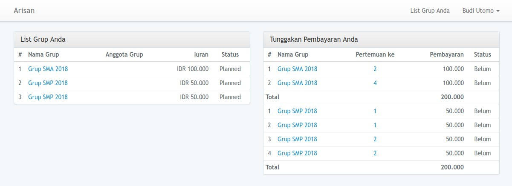
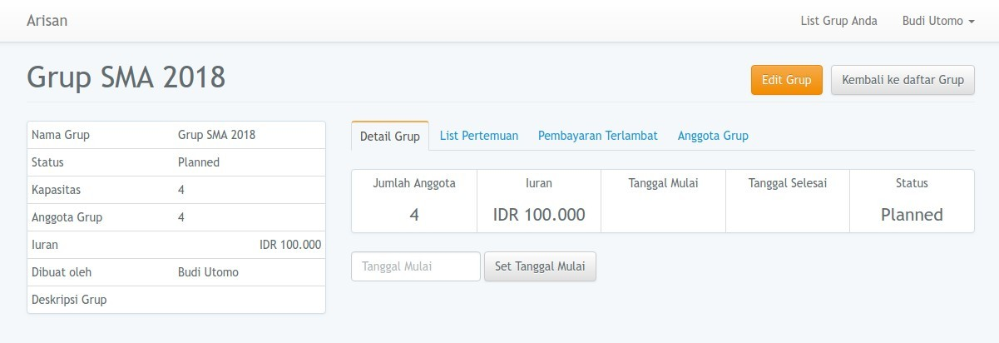
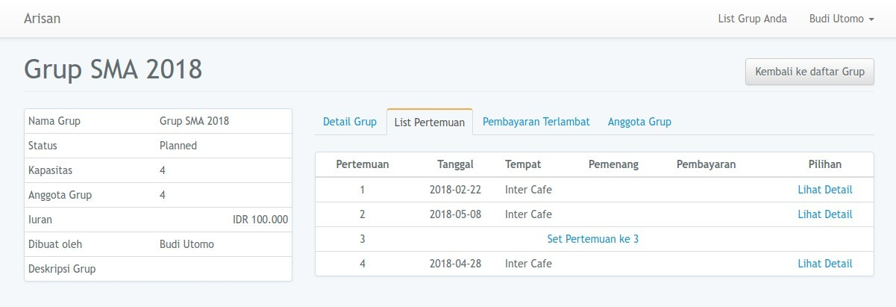
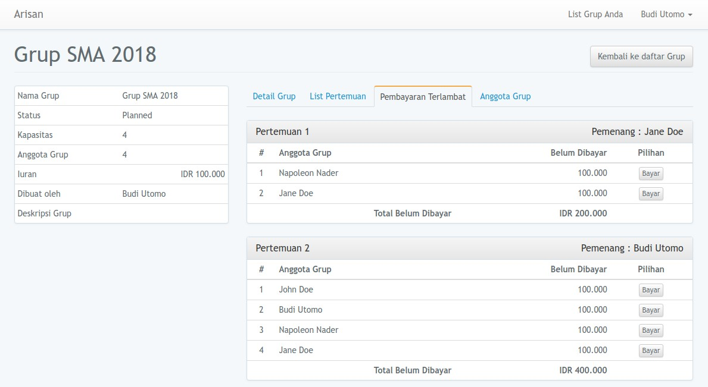
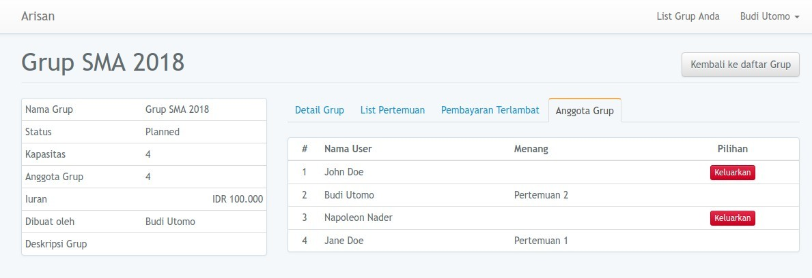

# Arisan

Arisan adalah sebuah sistem pengelolaan grup arisan berbasis web yang dibangun dengan framework Laravel 5.

## Tujuan
Arisan bertujuan untuk mempermudah pengelola arisan dalam mengatur pertemuan dan mengelola pembayaran anggota.

## Konsep

Untuk mencapai tujuan di atas, berikut adalah konsep yang akan diterapkan pada sistem ini :

- [x] Setiap user dapat mendaftar.
- [x] Setiap user dapat membuat grup arisan (satu atau lebih).
- [x] Setiap grup arisan dapat diisi sejumlah anggota (user) dengan kapasitas tertentu (limit 20 anggota).
- [x] Satu user boleh sebagai lebih dari 1 anggota di dalam satu grup.
- [x] Setiap grup arisan ada list pertemuan sesuai jumlah anggota.
- [x] Setiap grup ada pengaturan currency/mata uang, jumlah iuran arisan, dan kapasitas anggota.
- [ ] Setiap satu pertemuan ada tanggal, tempat, nama anggota yg dapat arisan, rekening yang dapat arisan, list anggota belum bayar iuran.
- [ ] Pada list pembayaran ada jumlah yang dibayar, tanggal, user tujuan bayar (dibayar ke siapa), cara bayar.

Sementara itu dulu konsepnya, jika ada perkembangan, akan diupdate kembali.

## Cara Install

#### Spesifikasi minimum server
1. PHP 7.2 (dan memenuhi [server requirement Laravel 5.5](https://laravel.com/docs/5.5#server-requirements)),
2. MySQL 5.7 atau MariaDB 10.2,
3. SQlite (untuk automated testing).

> Jika menggunakan MySQL < 5.7 atau MariaDB < 10.2, silakan [cek solusi ini](https://github.com/nafiesl/arisan/issues/2#issuecomment-392324454).

#### Tahap Install

1. Clone Repo, pada terminal : `$ git clone https://github.com/nafiesl/arisan.git nama-folder`
2. `$ cd arisan`
3. `$ composer install`
4. `$ cp .env.example .env` (Duplikat file `.env.example` menjadi `.env`)
5. `$ php artisan key:generate`
6. Buat **database pada mysql** untuk aplikasi ini
7. **Setting database** pada file `.env`
8. `$ php artisan migrate`
9. `$ php artisan serve`
10. Selesai (Register user baru untuk mulai mengisi arisan).

## Testing

```bash
$ vendor/bin/phpunit
```

## Screenshot

#### Dashboard

Setiap member/anggota grup yang login akan melihat daftar grup arisan, dengan list tunggakan pembayaran per grupnya.



#### Detail Grup Arisan

Setiap member dapat melihat detail grup arisan yang diikutinya.



#### List Pertemuan Grup



#### List Pembayaran Terlambat Grup



#### List Anggota Grup




## Lisensi

Project Arisan merupakan software free dan open source di bawah [lisensi MIT](LICENSE).